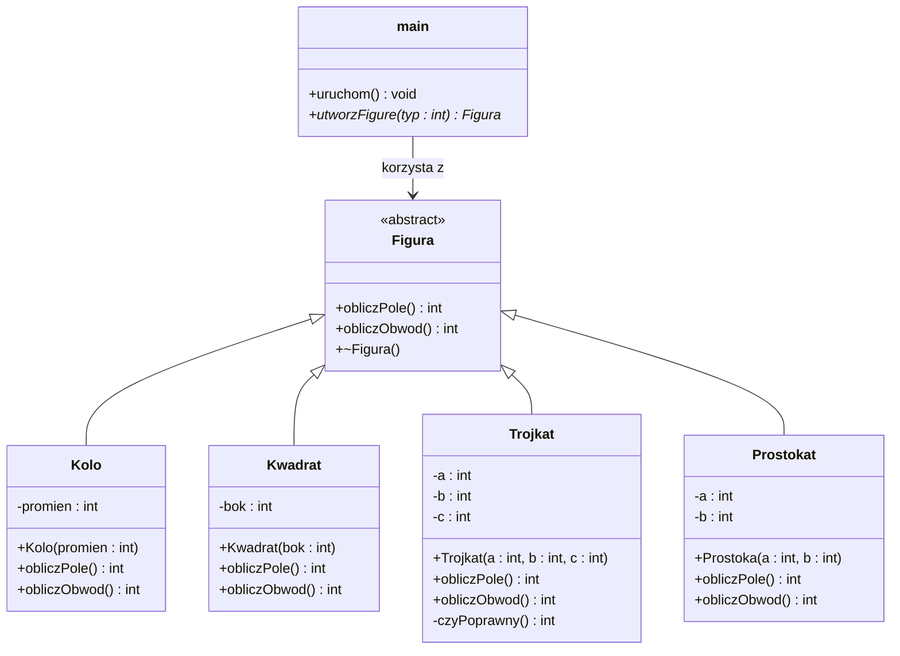

# Zadanie laboratoryjne  


[](https://en.cppreference.com/w/)
[](https://docs.oracle.com/en/java/)

**Przedmiot:** *Programowanie obiektowe*  

##  Dane studenta


| Pole | Wartość |
|---|---|
| Imię i nazwisko | Szymon Zeller |
| Numer albumu | 10149 |
| Kierunek / specjalność | Informatyka |
| Rok/Semestr | I |
| Grupa laboratoryjna | grupa 1 |
| Rok akademicki |  2025/2026 |
| Prowadzący | mgr inż. Artur Pelo |

##  Informacje o zadaniu

| Pole | Wartość |
|---|---|
| Numer laboratorium | 1 |
| Temat laboratorium | Podstawy programowania obiektowego - dziedziczenie i polimorfizm |
| Data realizacji | 24.03.2026 |
| Data oddania | 25.03.2026 |
| Język programowania | CPP |
| Środowisko / IDE | VSC |

##  Treść zadania

Krótki opis zadania:

Napisz program, który umożliwa obliczanie pola i obwodu figur płaskich.
Figury to kolo, kwadrat i trójkąt. Zastosuj polimorfizm.

##  Wymagania funkcjonalne

| ID | Opis wymagania | Poziom |
|---|---|---|
| WF-01 | Program umożliwia wybór figury: koło, kwadrat lub trójkąt. | Wysoki |
| WF-02 | Dla każdej figury program oblicza pole. | Wysoki |
| WF-03 | Dla każdej figury program oblicza obwód. | Wysoki |
| WF-04 | Implementacja wykorzystuje klasę abstrakcyjną i polimorfizm w klasach potomnych. | Wysoki |

##  Wymagania niefunkcjonalne

| ID | Opis wymagania | Poziom |
|---|---|---|
| WN-01 | Kod jest napisany w języku C++ zgodnie z zasadami programowania obiektowego. | Wysoki |
| WN-02 | Program kompiluje się bez błędów w standardowym kompilatorze C++ (np. g++). | Wysoki |
| WN-03 | Kod jest czytelny i podzielony na klasy odpowiadające figurom. | Średni |
| WN-04 | Interfejs tekstowy programu zawiera jasne komunikaty dla użytkownika. | Średni |

##  Realizacja zadania


Opis implementacji:

Program spełnia wszystkie wymagania funkcjonalne oraz niefunkcjonalne.

##  Diagram klas (jeśli dotyczy)


##  Kod źródłowy


###  C++

```cpp
#include <iostream>
#include <cmath>

using namespace std;

class Figura{       //Klasa abstrakcyjna
    public:
    virtual int obliczPole() = 0;
    virtual int obliczObwod() = 0;
};

class Kwadrat : public Figura{
    private:
        int a;
    public:
        Kwadrat(double a) : a(a) {}
        int obliczPole() override {
            return a*a;
        }
        int obliczObwod() override {
            return 4*a;
        }

    Kwadrat(int a){
        this->a=a;
    }
};

class Kolo : public Figura{
    private:
        int r;
    public:
        int obliczPole() override{
            return 2*3.14*r;
        }
        int obliczObwod() override{
            return 3.13*r*r;
        }

    Kolo(int r){
        this->r=r;
    }
};

class Prostokat : public Figura{
    private:
        int a,b;
    public:
        int obliczPole() override{
            return a*b;
        }
        int obliczObwod() override{
            return 2*a + 2*b;
        }
    
    Prostokat(int a,int b){
        this->a=a;
        this->b=b;
    }
};

class Trojkat : public Figura{
    private:
        int a,b,c;
    public:
        int obliczPole() override{
            int p = (a+b+c)/2;
            return sqrt(p*(p-a)*(p-b)*(p-c));
        }
        int obliczObwod() override{
            return a+b+c;
        }

    Trojkat(int a, int b, int c){
        this->a=a;
        this->b=b;
        this->c=c;
    }
};


int main(int argc, char const *argv[])
{
    //Tworzenie obiektów klas
    Kwadrat *kwadrat1 = new Kwadrat(4);
    Kolo *kolo1 = new Kolo(3);
    Prostokat *prostokat1 = new Prostokat(3,4);
    Trojkat *trojkat1 = new Trojkat(5,5,4);
    Figura *user;

    int decyzja = -1;

    do{
        cout<<"     <---------->     "<<endl;
        cout<<"1 - Kolo"<<endl;
        cout<<"2 - Kwadrat"<<endl;
        cout<<"3 - Prostokat"<<endl;
        cout<<"4 - Trojkat"<<endl;
        cout<<"5 - pole figury"<<endl;
        cout<<"6 - obwod figury"<<endl;
        cout<<"0 - exit"<<endl;

        cin>>decyzja;

        switch(decyzja){
            case 1:
                user = kolo1;
                break;
            case 2:
                user = kwadrat1;
                break;
            case 3:
                user = prostokat1;
                break;
            case 4:
                user = trojkat1;
                break;
            case 5:
                if(user != nullptr) cout<<"Pole to: "<<user->obliczPole();
                else cout<<"Najpierw wybierz figure";
                break;
            case 6:
                if(user != nullptr) cout<<"Obwod to: "<<user->obliczObwod();
                else cout<<"Najpierw wybierz figure";
                break;
            case 0:
                break;
            default:
                cout<<"Nieznana opcja";
                break;
        }

    }while(decyzja != 0);

    delete(kwadrat1, kolo1, prostokat1, trojkat1);
    return 0;
}


```

##  Wynik działania programu

Opis testów i przykładowe wyniki:

Wybranie trójkąta, wykonanie operacji pola i obwodu oraz wyjście z programu
```bash
PS D:\CODE\VSCODE\PRJ\programowanie_obiektowe\2026_03_17\2026_03_17_Lab1>  & 'c:\Users\Orrimano\.vscode\extensions\ms-vscode.cpptools-1.30.5-win32-x64\debugAdapters\bin\WindowsDebugLauncher.exe' '--stdin=Microsoft-MIEngine-In-enmwzkk4.q0v' '--stdout=Microsoft-MIEngine-Out-q0fmvbd3.liv' '--stderr=Microsoft-MIEngine-Error-krdjfytm.0bv' '--pid=Microsoft-MIEngine-Pid-4bs44awa.wou' '--dbgExe=C:\msys64\ucrt64\bin\gdb.exe' '--interpreter=mi' 
     <---------->     
1 - Kolo
2 - Kwadrat
3 - Prostokat
4 - Trojkat
5 - pole figury
6 - obwod figury
0 - exit
4
     <---------->     
1 - Kolo
2 - Kwadrat
3 - Prostokat
4 - Trojkat
5 - pole figury
6 - obwod figury
0 - exit
5
Pole to: 9     <---------->     
1 - Kolo
2 - Kwadrat
3 - Prostokat
4 - Trojkat
5 - pole figury
6 - obwod figury
0 - exit
6
Obwod to: 14     <---------->     
1 - Kolo
2 - Kwadrat
3 - Prostokat
4 - Trojkat
5 - pole figury
6 - obwod figury
0 - exit
0
PS D:\CODE\VSCODE\PRJ\programowanie_obiektowe\2026_03_17\2026_03_17_Lab1> 

```

Wybranie Kwadratu, wykonanie operacji pola i obwodu oraz wyjście z programu

```bash
PS D:\CODE\VSCODE\PRJ\programowanie_obiektowe\2026_03_17\2026_03_17_Lab1>  & 'c:\Users\Orrimano\.vscode\extensions\ms-vscode.cpptools-1.30.5-win32-x64\debugAdapters\bin\WindowsDebugLauncher.exe' '--stdin=Microsoft-MIEngine-In-naflwslr.3e5' '--stdout=Microsoft-MIEngine-Out-oxql4nnb.stj' '--stderr=Microsoft-MIEngine-Error-ijwwtdmc.ffn' '--pid=Microsoft-MIEngine-Pid-lk4k2s52.l2m' '--dbgExe=C:\msys64\ucrt64\bin\gdb.exe' '--interpreter=mi'
     <---------->     
1 - Kolo
2 - Kwadrat
3 - Prostokat
4 - Trojkat
5 - pole figury
6 - obwod figury
0 - exit
2
     <---------->     
1 - Kolo
2 - Kwadrat
3 - Prostokat
4 - Trojkat
5 - pole figury
6 - obwod figury
0 - exit
5
Pole to: 16     <---------->     
1 - Kolo
2 - Kwadrat
3 - Prostokat
4 - Trojkat
5 - pole figury
6 - obwod figury
0 - exit
6
Obwod to: 16     <---------->     
1 - Kolo
2 - Kwadrat
3 - Prostokat
4 - Trojkat
5 - pole figury
6 - obwod figury
0 - exit
0
PS D:\CODE\VSCODE\PRJ\programowanie_obiektowe\2026_03_17\2026_03_17_Lab1> 

```
##  Samoocena studenta

| Kryterium | Tak / Nie | Uwagi |
|---|---|---|
| Program kompiluje się bez błędów | X |  |
| Wszystkie wymagania zostały spełnione | X |  |
| Kod jest czytelny i podzielony na klasy | X |  |
| Zastosowano zasady OOP | X |  |
| Zastosowano zasady czystego kodu | X |  |
| Zastosowano wzorce projektowe (jakie?) | X |  |


##Przesłanie pliu do oceny:
[](https://upload.pelo.com.pl) [zawartość, uzupełniony TEN plik oraz podfolder LAB1 z plikami zródłowymi]


##  Ocena prowadzącego

| Element oceny | Punkty maks. | Punkty uzyskane |
|---|---:|---:|
| Poprawność działania | 5 |  |
| Zastosowanie OOP | 5 |  |
| Jakość kodu | 3 |  |
| Terminowość oddania | 2 |  |
| **Suma** | **15** |  |

Uwagi prowadzącego:

................................................................................

................................................................................

Podpis prowadzącego: ........................................................

