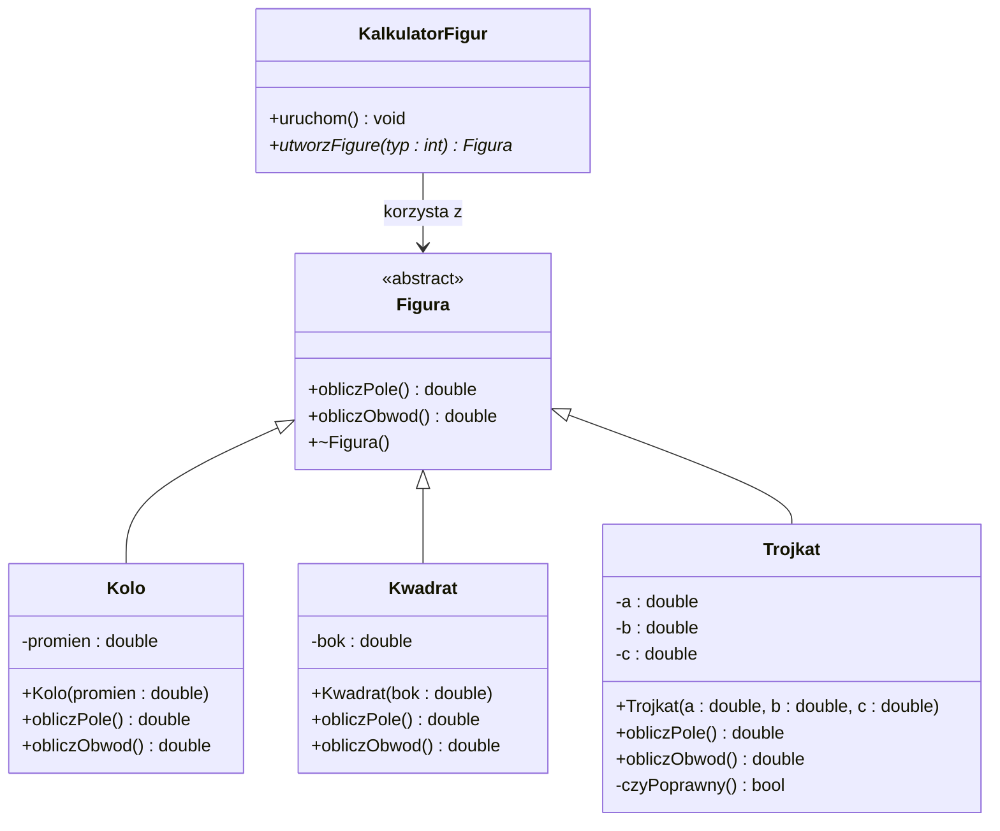

# Zadanie laboratoryjne  


[](https://en.cppreference.com/w/)
[](https://docs.oracle.com/en/java/)

**Przedmiot:** *Programowanie obiektowe*  

##  Dane studenta


| Pole | Wartość |
|---|---|
| Imię i nazwisko | Szymon Zeller |
| Numer albumu | 10149 |
| Kierunek / specjalność | Informatyka |
| Rok/Semestr | I |
| Grupa laboratoryjna | grupa 1 |
| Rok akademicki |  2025/2026 |
| Prowadzący | mgr inż. Artur Pelo |

##  Informacje o zadaniu

| Pole | Wartość |
|---|---|
| Numer laboratorium | 1 |
| Temat laboratorium | Podstawy programowania obiektowego - dziedziczenie i polimorfizm |
| Data realizacji | 17.03.2026 |
| Data oddania | 17.03.2026 |
| Język programowania | CPP/JAVA |
| Środowisko / IDE | VSC/VS/ IntelliJ IDEA|

##  Treść zadania

Krótki opis zadania:

Napisz program, który umożliwa obliczanie pola i obwodu figur płaskich.
Figury to kolo, kwadrat i trójkąt. Zastosuj polimorfizm.

##  Wymagania funkcjonalne

| ID | Opis wymagania | Poziom |
|---|---|---|
| WF-01 | Program umożliwia wybór figury: koło, kwadrat lub trójkąt. | Wysoki |
| WF-02 | Dla każdej figury program oblicza pole. | Wysoki |
| WF-03 | Dla każdej figury program oblicza obwód. | Wysoki |
| WF-04 | Implementacja wykorzystuje klasę abstrakcyjną i polimorfizm w klasach potomnych. | Wysoki |

##  Wymagania niefunkcjonalne

| ID | Opis wymagania | Poziom |
|---|---|---|
| WN-01 | Kod jest napisany w języku C++ zgodnie z zasadami programowania obiektowego. | Wysoki |
| WN-02 | Program kompiluje się bez błędów w standardowym kompilatorze C++ (np. g++). | Wysoki |
| WN-03 | Kod jest czytelny i podzielony na klasy odpowiadające figurom. | Średni |
| WN-04 | Interfejs tekstowy programu zawiera jasne komunikaty dla użytkownika. | Średni |

##  Realizacja zadania


Opis implementacji:

................................................................................

##  Diagram klas (jeśli dotyczy)


##  Kod źródłowy


###  C++

```cpp
	#include <cmath>
	#include <iomanip>
	#include <iostream>
	#include <memory>
	#include <stdexcept>
	#include <vector>

	class Figura {
	public:
		virtual double obliczPole() const = 0;
		virtual double obliczObwod() const = 0;
		virtual ~Figura() = default;
	};

	class Kolo : public Figura {
	private:
		double promien;

	public:
		explicit Kolo(double p) : promien(p) {
			if (p <= 0.0) {
				throw std::invalid_argument("Promien musi byc dodatni.");
			}
		}

		double obliczPole() const override {
			return M_PI * promien * promien;
		}

		double obliczObwod() const override {
			return 2.0 * M_PI * promien;
		}
	};

	class Kwadrat : public Figura {
	private:
		double bok;

	public:
		explicit Kwadrat(double b) : bok(b) {
			if (b <= 0.0) {
				throw std::invalid_argument("Bok musi byc dodatni.");
			}
		}

		double obliczPole() const override {
			return bok * bok;
		}

		double obliczObwod() const override {
			return 4.0 * bok;
		}
	};

	class Trojkat : public Figura {
	private:
		double a, b, c;

	public:
		Trojkat(double a, double b, double c) : a(a), b(b), c(c) {
			if (a <= 0.0 || b <= 0.0 || c <= 0.0) {
				throw std::invalid_argument("Boki trojkata musza byc dodatnie.");
			}
			if (a + b <= c || a + c <= b || b + c <= a) {
				throw std::invalid_argument("Podane boki nie tworza trojkata.");
			}
		}

		double obliczObwod() const override {
			return a + b + c;
		}

		double obliczPole() const override {
			double p = obliczObwod() / 2.0;
			return std::sqrt(p * (p - a) * (p - b) * (p - c));
		}
	};

	int main() {
		std::vector<std::unique_ptr<Figura>> figury;
		figury.push_back(std::make_unique<Kolo>(3.0));
		figury.push_back(std::make_unique<Kwadrat>(4.0));
		figury.push_back(std::make_unique<Trojkat>(3.0, 4.0, 5.0));

		std::cout << std::fixed << std::setprecision(2);
		for (const auto& figura : figury) {
			std::cout << "Pole: " << figura->obliczPole()
					  << ", Obwod: " << figura->obliczObwod() << '\n';
		}

		return 0;
	}
```

###  Java

```java
	abstract class Figura {
		public abstract double obliczPole();
		public abstract double obliczObwod();
	}

	class Kolo extends Figura {
		private final double promien;

		public Kolo(double promien) {
			if (promien <= 0) {
				throw new IllegalArgumentException("Promien musi byc dodatni.");
			}
			this.promien = promien;
		}

		@Override
		public double obliczPole() {
			return Math.PI * promien * promien;
		}

		@Override
		public double obliczObwod() {
			return 2 * Math.PI * promien;
		}
	}

	class Kwadrat extends Figura {
		private final double bok;

		public Kwadrat(double bok) {
			if (bok <= 0) {
				throw new IllegalArgumentException("Bok musi byc dodatni.");
			}
			this.bok = bok;
		}

		@Override
		public double obliczPole() {
			return bok * bok;
		}

		@Override
		public double obliczObwod() {
			return 4 * bok;
		}
	}

	class Trojkat extends Figura {
		private final double a;
		private final double b;
		private final double c;

		public Trojkat(double a, double b, double c) {
			if (a <= 0 || b <= 0 || c <= 0) {
				throw new IllegalArgumentException("Boki trojkata musza byc dodatnie.");
			}
			if (a + b <= c || a + c <= b || b + c <= a) {
				throw new IllegalArgumentException("Podane boki nie tworza trojkata.");
			}
			this.a = a;
			this.b = b;
			this.c = c;
		}

		@Override
		public double obliczObwod() {
			return a + b + c;
		}

		@Override
		public double obliczPole() {
			double p = obliczObwod() / 2.0;
			return Math.sqrt(p * (p - a) * (p - b) * (p - c));
		}
	}

	public class Main {
		public static void main(String[] args) {
			Figura[] figury = {
				new Kolo(3),
				new Kwadrat(4),
				new Trojkat(3, 4, 5)
			};

			for (Figura figura : figury) {
				System.out.printf("Pole: %.2f, Obwod: %.2f%n", figura.obliczPole(), figura.obliczObwod());
			}
		}
	}
```

##  Wynik działania programu

Opis testów i przykładowe wyniki:

................................................................................

................................................................................

```bash
.............

```
##  Samoocena studenta

| Kryterium | Tak / Nie | Uwagi |
|---|---|---|
| Program kompiluje się bez błędów |  |  |
| Wszystkie wymagania zostały spełnione |  |  |
| Kod jest czytelny i podzielony na klasy |  |  |
| Zastosowano zasady OOP |  |  |
| Zastosowano zasady czystego kodu |  |  |
| Zastosowano wzorce projektowe (jakie?) |  |  |


##Przesłanie pliu do oceny:
[](https://upload.pelo.com.pl) [zawartość, uzupełniony TEN plik oraz podfolder LAB1 z plikami zródłowymi]


##  Ocena prowadzącego

| Element oceny | Punkty maks. | Punkty uzyskane |
|---|---:|---:|
| Poprawność działania | 5 |  |
| Zastosowanie OOP | 5 |  |
| Jakość kodu | 3 |  |
| Terminowość oddania | 2 |  |
| **Suma** | **15** |  |

Uwagi prowadzącego:

................................................................................

................................................................................

Podpis prowadzącego: ........................................................

